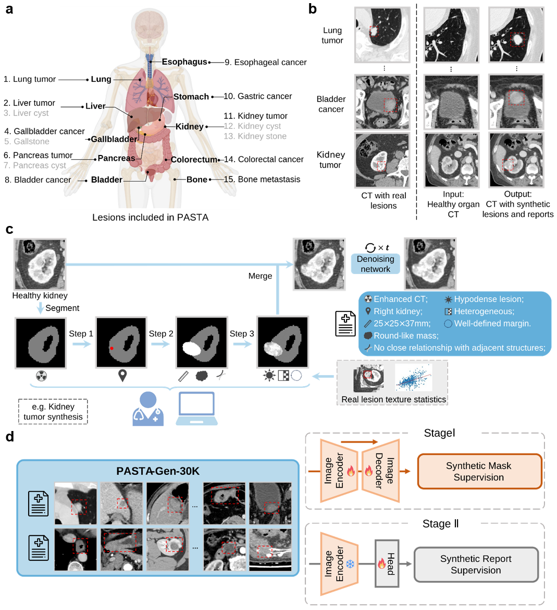
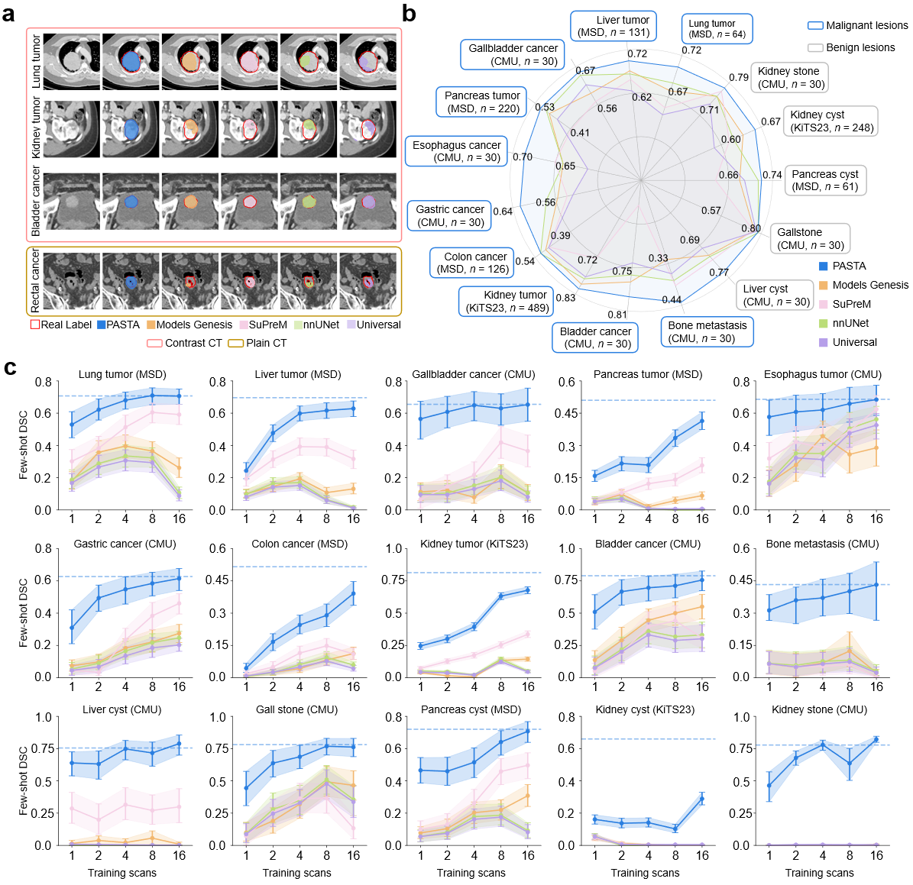
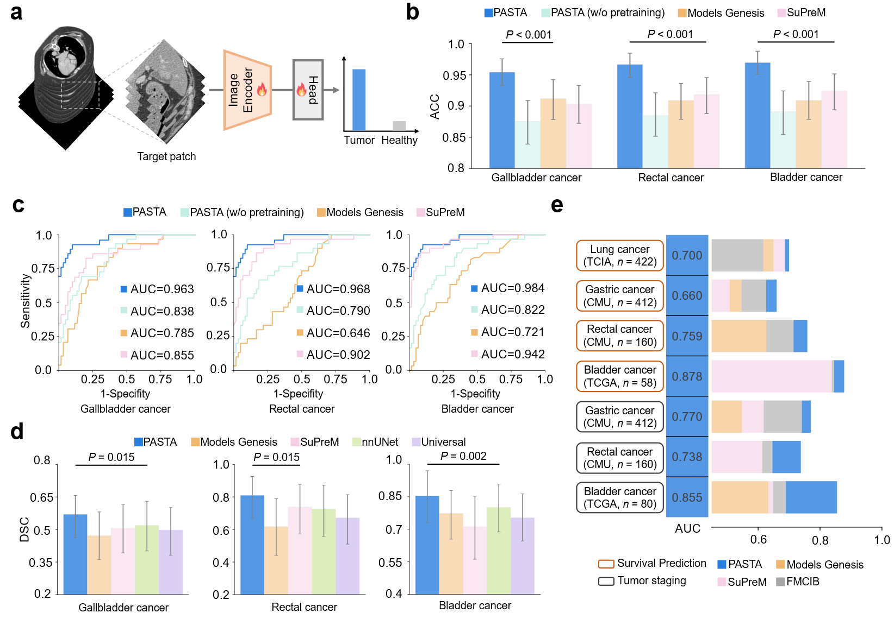
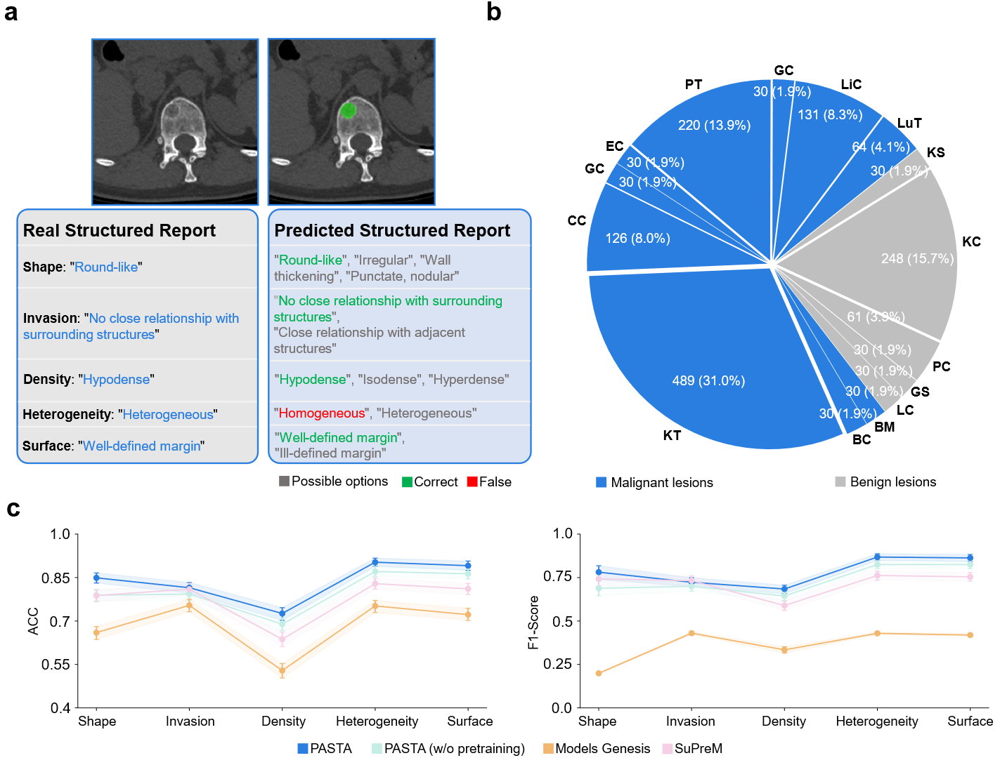

# PASTA
A Synthetic Data-Driven Radiology Foundation Model for Pan-tumor Clinical Diagnosis

[Paper](https://arxiv.org/abs/2502.06171); [Dataset](https://huggingface.co/datasets/LWHYC/PASTA-Gen-30K); [Code](https://github.com/LWHYC/PASTA?tab=readme-ov-file)


# Overview
PASTA (Pan-Tumor Analysis with Synthetic Training Augmentation) is a data-efficient foundation model for analyzing diverse tumor lesions in 3D CT scans. Leveraging PASTA-Gen-30K, a large-scale synthetic dataset of 30,000 CT volumes with precise lesion masks and structured textual reports, PASTA addresses the scarcity of high-quality annotated data that traditionally hinders radiological AI research.

PASTA achieves state-of-the-art results on a wide range of tasks, including:

- Tumor detection in plain CT
- Lesion segmentation
- Tumor staging
- Survival prediction
- Structured report generation
- Cross-modality transfer learning



Workflow of PASTA Model Development and Training Pipeline. a, Overview of organs and lesion
types involved in PASTA training. b, Examples of lesions generated by PASTA-Gen from healthy organs. c,
Lesion generation process pipeline of PASTA-Gen. d, Two-stage training of PASTA using the PASTA-Gen-30K dataset.


# Key Features
1. **Synthetic Data Backbone**
Relies on PASTA-Gen-30K for training, bypassing the privacy constraints and annotation burdens associated with real clinical data.
2. **Data-Efficient**
Excels in few-shot settings, requiring only a small set of real-world annotated scans to reach high-performance levels.
3. **Pan-Tumor Coverage**
Encompasses malignancies across ten organ systems and five benign lesion types, designed for broad oncology analysis.
<!-- 
# Main results


Comparison on Lesion Segmentation. a, Example images of lesion segmentation results from various models. b, Comparison of model performance in lesion segmentation with sufficient data, measured by Dice Similarity Coefficients (DSC). c, Lesion segmentation performance of models under few-shot settings, with blue dashed lines indicating PASTA's full-data training results. Error bands denote 95% confidence intervals.



Performance on Various Oncological Tasks. a, Workflow of the classification tasks: target patches are cropped and passed through the encoder, followed by an MLP head to predict class probabilities. For tumor detection in plain CT scans (b, c), the target patch corresponds to the organ of interest, while for survival prediction and tumor staging tasks (e), the target patch is centered around the tumor region. b, c, Tumor identification performance of accuracy (b) and AUC (c) of models on Plain-CT data. d, Tumor segmentation performance (DSC) on plain-CT data. e, Performance of models in tumor staging and survival prediction across various tumor types. Bars in b and d plot displaying 95% confidence intervals as error bands.



Comparison on Structured Lesion Report Generation. a, Example of real and predicted lesion structure reports for bone metastasis generated by PASTA. b, Composition of the structured lesion report dataset, including 10 malignant lesion types (LuT: lung tumor, LiC: liver cancer, GC: gallbladder cancer, PT: pancreas tumor, EC: esophagus cancer, GC: gastric cancer, CC: colon cancer, KT: kidney tumor, BC: bladder cancer, and BM: bone metastasis) and 5 benign lesion types (LC: liver cyst, GS: gallstone, PC: pancreas cyst, KC: kidney cyst, and kidney stone). c, Comparison of Accuracy (ACC) and F1-scores for five structured report attributes across different models. Error bands denote 95% confidence intervals. -->

## PASTA-Gen-30K
- Pretraining dataset PASTA-Gen-30K is available at [Hugging Face](https://huggingface.co/datasets/LWHYC/PASTA-Gen-30K).
    - Each synthetic 3D CT volume includes pixel-level lesion annotations and a structured radiological report.

## PASTA Pretrained Checkpoint
- [Google Drive](https://drive.google.com/file/d/1A_PjIAqKg0y_Z986HSfTsYKLhc99EMkD/view?usp=drive_link)


## Installation

### Quick Setup

```bash
# 1. Create conda environment
conda create -n pasta python=3.9
conda activate pasta

# 2. Install PyTorch (according to your CUDA version)
pip install torch torchvision --index-url https://download.pytorch.org/whl/cu118

# 3. Install dependencies
pip install -r requirements.txt

# 4. Install local nnUNetv2 (customized version for PASTA)
cd segmentation && pip install -e . && cd ..
```

# Data Standardization

**⚠️ All tasks require data standardization as the first step!**

## Quick Start

Standardize your dataset to **1x1x1mm spacing** and **RAS orientation**:

```bash
python preprocess/NifitiStandard.py \
    -indir /path/to/original/data/root \
    -outdir /path/to/save/data/root
```

## Details

- **CT images** (min < -10): Linear interpolation
- **Segmentation labels** (min > -10): Nearest-neighbor interpolation
- Segmentation labels are **not needed for classification tasks**


# Feature Extraction
**After standardizing your dataset**, example code for extracting features from the PASTA pretrained model:

    python feature_extraction.py


# Segmentation

**⚠️ Segmentation tasks require nnUNet format. Please read [nnUNet Dataset Format Documentation](https://github.com/MIC-DKFZ/nnUNet/blob/master/documentation/dataset_format.md) first to familiarize yourself with the data organization.**

## Setup Environment Variables

Setup nnUNet paths:

```bash
# Permanent (add to ~/.bashrc)
echo 'export nnUNet_raw="/path/to/nnUNet_raw"' >> ~/.bashrc
echo 'export nnUNet_preprocessed="/path/to/nnUNet_preprocessed"' >> ~/.bashrc
echo 'export nnUNet_results="/path/to/nnUNet_results"' >> ~/.bashrc
source ~/.bashrc
```

**What are these paths?**
- `nnUNet_raw`: Your datasets in nnUNet format (you create this)
- `nnUNet_preprocessed`: Auto-generated during training
- `nnUNet_results`: Training outputs and checkpoints

## Data Preparation

### Step 1: Standardize (if not done yet)
```bash
python preprocess/NifitiStandard.py -indir /path/to/original -outdir /path/to/standardized
```

### Step 2: Organize in nnUNet Format

Organize standardized data following [nnUNet format](https://github.com/MIC-DKFZ/nnUNet/blob/master/documentation/dataset_format.md):

```
$nnUNet_raw/DatasetXXX_TaskName/
├── imagesTr/
│   ├── case001_0000.nii.gz
│   └── case002_0000.nii.gz
├── labelsTr/
│   ├── case001.nii.gz
│   └── case002.nii.gz
└── dataset.json
```

**Key points:**
- Images: `caseName_0000.nii.gz` (0000 for single-channel CT)
- Labels: `caseName.nii.gz` (same name without `_0000`)
- Create `dataset.json` with metadata (see [nnUNet docs](https://github.com/MIC-DKFZ/nnUNet/blob/master/documentation/dataset_format.md))

## Training & Inference

### Finetuning

```bash
python segmentation/nnunetv2/run/run_finetuning_pasta.py \
    3d_fullres PASTATrainer TASKID FOLD \
    -pretrained_weights /path/to/PASTA_final.pth
```

### Few-shot Training

First, modify `splits_final.json` to set the number of training samples per fold, then:

```bash
python segmentation/nnunetv2/run/run_finetuning_pasta.py \
    3d_fullres PASTATrainer_fewshot TASKID FOLD \
    -pretrained_weights /path/to/PASTA_final.pth
```

### Inference

```bash
# Finetuning model
python segmentation/inference/inference.py \
    -indir $nnUNet_raw/Dataset00x_xxx/imagesTr \
    -outdir $nnUNet_raw/Dataset00x_xxx/predictions \
    -split_json $nnUNet_raw/Dataset00x_xxx/splits_final.json \
    -trainer PASTATrainer_ft

# Few-shot model
python segmentation/inference/inference.py \
    -indir $nnUNet_raw/Dataset00x_xxx/imagesTr \
    -outdir $nnUNet_raw/Dataset00x_xxx/predictions_fewshot \
    -split_json $nnUNet_raw/Dataset00x_xxx/splits_final.json \
    -trainer PASTATrainer_fewshot
```

The fine-tuned segmentation PASTA model checkpoint for public datasets is available at [here](https://upenn.box.com/s/nqz6dwrgxjf49rmmnejobqo0en1no3xt)

### Metric Calculation

```bash
python segmentation/inference/cal_metric.py \
    -predic_root /path/to/predictions \
    -label_root $nnUNet_raw/Dataset00x_xxx/labelsTr \
    -fg_class_num NUM_CLASSES
```

# Classification
## Plain-CT tumor detection
For plain-ct tumor detection tasks, please prepare your dataset follow the intruction in `preprocess/Crop_plainct_tumor.ipynb`.

### Training:
Adjust the `train_image_list`, `train_label_list`, `valid_image_list`, `valid_label_list`, `pretrained_model_path` in the training bash:

    CUDA_VISIBLE_DEVICES=0,1,2,3 torchrun --nproc_per_node=4 --master_port=$PORT ./train/train_classify_binary.py \
        --train_image_list config/data/PlainCT/yourdata/fold_0/train_image.txt \
        --train_label_list config/data/PlainCT/yourdata/fold_0/train_label.txt \
        --valid_image_list config/data/PlainCT/yourdata/fold_0/valid_image.txt \
        --valid_label_list config/data/PlainCT/yourdata/fold_0/valid_label.txt \
        --net_type Generic_UNet_classify \
        --input_channel 1 \
        --output_channel 2 \
        --base_feature_number 64 \
        --pretrained_model_path /path/to/pasta_checkpoint/PASTA_final.pth \
        --model_save_name weights/PASTA_classify/PASTA_classify_plainct_fold_0 \
        --batch_size 8 \
        --num_workers 6 \
        --learning_rate 1e-4 \
        --decay 1e-5 \
        --total_step 5000 \
        --start_step 0 \
        --save_step 1000 \
        --log_freq 100 \
        --accumulation_steps 1 \
        --class_num 2 \
        --class_weight 1 10 \
        --crop_shape 128 128 128

The template 5-fold training bash for PASTA, SupreM, ModelsGenesis, UNet is at:

    bash classification/scripts/plainct/full/PASTA/train_all.sh
    bash classification/scripts/plainct/full/SupreM/train_all.sh
    bash classification/scripts/plainct/full/modelgenesis/train_all.sh
    bash classification/scripts/plainct/full/UNet/train_all.sh

### Inference:
Adjust the `valid_image_list`, `valid_label_list`, `pretrained_model_path` in the inference bash. The `pretrained_model_path` here is the path to your finetuned checkpoint:

    CUDA_VISIBLE_DEVICES=0 python test/test_classify_binary.py \
    --valid_image_list config/data/PlainCT/yourdata/fold_0/valid_image.txt \
    --valid_label_list config/data/PlainCT/yourdata/fold_0/valid_label.txt \
    --net_type Generic_UNet_classify \
    --input_channel 1 \
    --output_channel 2 \
    --base_feature_number 64 \
    --batch_size 1 \
    --pretrained_model_path weights/PASTA_classify/PASTA_classify_plainct_fold_0_best.tar \
    --class_num 2 \
    --crop_shape 128 128 128 \
    --output_json results/classify/Plain-CT/PASTA/fold_0.json

The template 5-fold inference bash for PASTA, SupreM, ModelsGenesis, UNet is at:

    bash classification/scripts/plainct/full/PASTA/test_all.sh
    bash classification/scripts/plainct/full/SupreM/test_all.sh
    bash classification/scripts/plainct/full/modelgenesis/test_all.sh
    bash classification/scripts/plainct/full/UNet/test_all.sh


# Acknowledgement

- We thank the authors of [nnUNet](https://github.com/MIC-DKFZ/nnUNet), [STU-Net](https://github.com/uni-medical/STU-Net), [FMCIB](https://github.com/AIM-Harvard/foundation-cancer-image-biomarker), [SynTumor](https://github.com/MrGiovanni/SyntheticTumors) for their great works. Please cite their papers if you use our code.

```bibtex
@article{isensee2021nnu,
  title={nnU-Net: a self-configuring method for deep learning-based biomedical image segmentation},
  author={Isensee, Fabian and Jaeger, Paul F and Kohl, Simon AA and Petersen, Jens and Maier-Hein, Klaus H},
  journal={Nature methods},
  volume={18},
  number={2},
  pages={203--211},
  year={2021},
  publisher={Nature Publishing Group}
}

@article{huang2023stu,
  title={Stu-net: Scalable and transferable medical image segmentation models empowered by large-scale supervised pre-training},
  author={Huang, Ziyan and Wang, Haoyu and Deng, Zhongying and Ye, Jin and Su, Yanzhou and Sun, Hui and He, Junjun and Gu, Yun and Gu, Lixu and Zhang, Shaoting and others},
  journal={arXiv preprint arXiv:2304.06716},
  year={2023}
}

@article{pai2024foundation,
  title={Foundation model for cancer imaging biomarkers},
  author={Pai, Suraj and Bontempi, Dennis and Hadzic, Ibrahim and Prudente, Vasco and Soka{\v{c}}, Mateo and Chaunzwa, Tafadzwa L and Bernatz, Simon and Hosny, Ahmed and Mak, Raymond H and Birkbak, Nicolai J and others},
  journal={Nature machine intelligence},
  volume={6},
  number={3},
  pages={354--367},
  year={2024},
  publisher={Nature Publishing Group UK London}
}

@inproceedings{hu2023label,
  title={Label-free liver tumor segmentation},
  author={Hu, Qixin and Chen, Yixiong and Xiao, Junfei and Sun, Shuwen and Chen, Jieneng and Yuille, Alan L and Zhou, Zongwei},
  booktitle={Proceedings of the IEEE/CVF Conference on Computer Vision and Pattern Recognition},
  pages={7422--7432},
  year={2023}
}